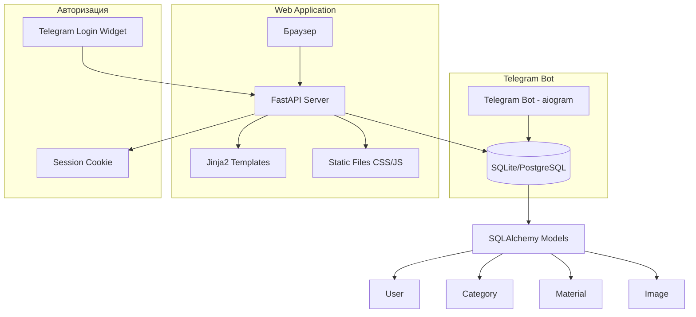
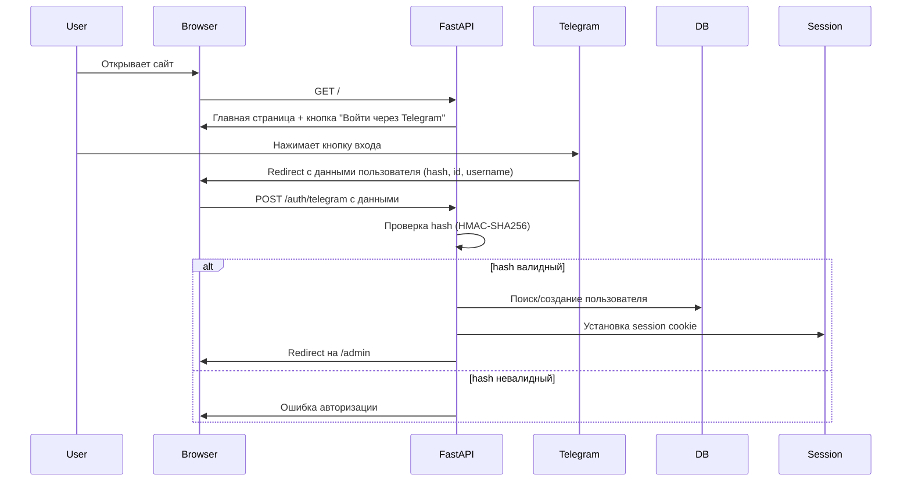
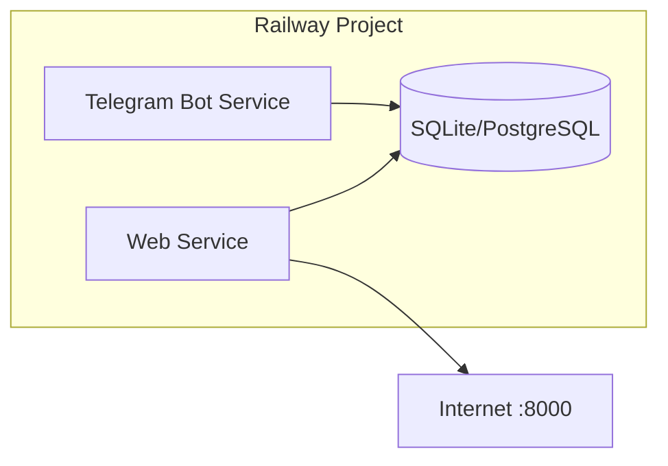

# Веб-версия бота обучения операторов

## 1. Общая архитектура



## 2. Структура проекта (дополнение к существующей)

```
e:/Account BOT/
├── bot/                          # Существующий Telegram бот
│   ├── ...
│   └── ...
│
├── web/                          # Новая папка для веб-версии
│   ├── __init__.py
│   ├── main.py                   # Точка входа FastAPI
│   ├── config.py                 # Конфигурация веба
│   ├── auth.py                   # Telegram Login Widget авторизация
│   ├── routes/
│   │   ├── __init__.py
│   │   ├── public.py             # Публичные маршруты (главная, разделы, материалы)
│   │   └── admin.py              # Админ-маршруты (CRUD)
│   ├── templates/
│   │   ├── base.html             # Базовый шаблон
│   │   ├── public/
│   │   │   ├── index.html        # Главная страница
│   │   │   ├── category.html     # Страница раздела
│   │   │   └── material.html     # Страница материала
│   │   └── admin/
│   │       ├── dashboard.html    # Админ-дашборд
│   │       ├── categories.html   # Управление разделами
│   │       ├── materials.html    # Управление материалами
│   │       └── stats.html        # Статистика
│   └── static/
│       ├── css/
│       │   └── style.css         # Кастомные стили
│       └── js/
│           └── main.js           # Кастомные скрипты
│
├── Coaching/                     # Существующая папка
├── requirements.txt              # Обновлённый
├── runtime.txt
├── Procfile                      # Обновлённый
└── .env                          # Обновлённый
```

## 3. Маршруты (Routes)

### 3.1 Публичные (доступны всем)

| Маршрут | Метод | Описание |
|---------|-------|----------|
| `/` | GET | Главная страница со списком разделов |
| `/category/{id}` | GET | Страница раздела со списком материалов |
| `/material/{id}` | GET | Страница материала с текстом и изображениями |
| `/login` | GET | Страница входа через Telegram |
| `/auth/telegram` | POST | Обработка Telegram Login Widget |

### 3.2 Админ-маршруты (только для авторизованных админов)

| Маршрут | Метод | Описание |
|---------|-------|----------|
| `/admin` | GET | Админ-дашборд |
| `/admin/categories` | GET | Список разделов |
| `/admin/categories/create` | GET/POST | Создание раздела |
| `/admin/categories/{id}/edit` | GET/POST | Редактирование раздела |
| `/admin/categories/{id}/delete` | POST | Удаление раздела |
| `/admin/materials` | GET | Список материалов |
| `/admin/materials/create` | GET/POST | Создание материала |
| `/admin/materials/{id}/edit` | GET/POST | Редактирование материала |
| `/admin/materials/{id}/delete` | POST | Удаление материала |
| `/admin/materials/{id}/images` | GET/POST | Управление изображениями |
| `/admin/stats` | GET | Статистика |

## 4. Авторизация через Telegram Login Widget



## 5. Дизайн (кастомный)

### 5.1 Цветовая схема
- **Основной цвет**: тёмно-фиолетовый `#6C3FAA` (ассоциация с вебкам-индустрией)
- **Вторичный**: розовый `#E91E8C`
- **Фон**: светлый `#F5F0FF`
- **Текст**: тёмный `#1A1A2E`
- **Карточки**: белые с тенью

### 5.2 Макет страниц

**Главная страница:**
```
┌─────────────────────────────────────┐
│  Лого              [Войти через TG] │
├─────────────────────────────────────┤
│                                     │
│  📚 Мануалы для операторов          │
│                                     │
│  ┌──────────┐  ┌──────────┐        │
│  │ 📹 OBS   │  │ 📁 Файлы │        │
│  │ ...      │  │ ...      │        │
│  └──────────┘  └──────────┘        │
│  ┌──────────┐  ┌──────────┐        │
│  │ 🌐 Платф. │  │ 💬 Общ.  │        │
│  │ ...      │  │ ...      │        │
│  └──────────┘  └──────────┘        │
│                                     │
└─────────────────────────────────────┘
```

**Страница материала:**
```
┌─────────────────────────────────────┐
│  ← Назад     [Раздел]              │
├─────────────────────────────────────┤
│                                     │
│  📄 Настройка OBS Studio            │
│                                     │
│  Текст инструкции...                │
│  Текст инструкции...                │
│                                     │
│  ┌─────────────────────────────┐   │
│  │      Изображение            │   │
│  │      (скриншот OBS)         │   │
│  └─────────────────────────────┘   │
│                                     │
│  Текст инструкции...                │
│                                     │
└─────────────────────────────────────┘
```

## 6. Технические детали

### 6.1 Дополнительные зависимости

```
fastapi>=0.110.0
uvicorn[standard]>=0.27.0
jinja2>=3.1.0
python-multipart>=0.0.9
aiofiles>=23.2.0
itsdangerous>=2.1.0  # для session cookies
```

### 6.2 Конфигурация (дополнение к .env)

```
# Веб-сервер
WEB_HOST=0.0.0.0
WEB_PORT=8000
SECRET_KEY=your-secret-key-here  # для подписи session cookie
TELEGRAM_BOT_NAME=your_bot_username  # для Telegram Login Widget
```

### 6.3 Запуск

**Для разработки** (одновременно бот + веб):
```bash
# Терминал 1: Telegram бот
python -m bot.main

# Терминал 2: Веб-сервер
uvicorn web.main:app --reload --port 8000
```

**Для продакшена** (на Railway):
- Railway запускает только одну команду из Procfile
- Нужно запускать и бота, и веб в одном процессе
- Либо использовать два сервиса на Railway

## 7. План реализации

### Шаг 1: Создать структуру веб-папок
- `web/`, `web/routes/`, `web/templates/public/`, `web/templates/admin/`, `web/static/css/`, `web/static/js/`

### Шаг 2: FastAPI приложение
- `web/main.py` — создание FastAPI приложения, подключение шаблонов и статики
- `web/config.py` — конфигурация
- `web/auth.py` — Telegram Login Widget авторизация

### Шаг 3: Публичные шаблоны
- `base.html` — базовый шаблон с навигацией
- `index.html` — главная с карточками разделов
- `category.html` — список материалов в разделе
- `material.html` — текст материала + изображения

### Шаг 4: Публичные маршруты
- `web/routes/public.py` — все публичные маршруты

### Шаг 5: Админ-шаблоны
- `dashboard.html` — дашборд
- `categories.html` — CRUD разделов
- `materials.html` — CRUD материалов
- `stats.html` — статистика

### Шаг 6: Админ-маршруты
- `web/routes/admin.py` — все админ-маршруты с проверкой авторизации

### Шаг 7: Кастомный дизайн
- `style.css` — кастомные стили
- `main.js` — интерактивные элементы

### Шаг 8: Обновление деплоя
- Обновить `requirements.txt`
- Обновить `Procfile` для запуска обоих сервисов
- Настроить Railway для двух сервисов

## 8. Деплой на Railway (два сервиса)



На Railway нужно создать **два сервиса** в одном проекте:
1. **Bot Service** — запускает `python -m bot.main`
2. **Web Service** — запускает `uvicorn web.main:app --host 0.0.0.0 --port $PORT`

Оба сервиса используют одну и ту же базу данных (SQLite файл или общий PostgreSQL).
